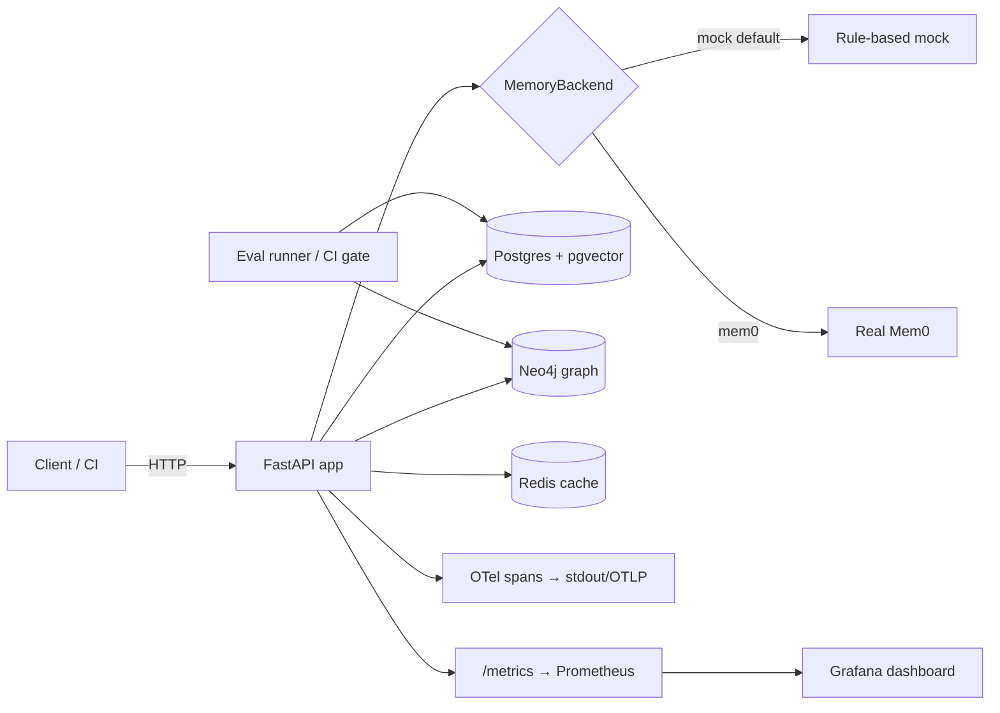

# MemGauge

**Catch memory-quality regressions in AI-agent memory layers before they ship.**

MemGauge is an observability and regression-gate harness for agent memory: it
adds and retrieves memories through a pluggable backend, scores retrieval
quality against a baseline, and fails CI when recall drops, latency balloons, or
the backend starts returning made-up facts.

## What it does (30 seconds)

Point MemGauge at a memory backend and it will: store facts (with an audit
trail), retrieve them with a transparent score breakdown (vector + keyword +
graph), track entities and relationships in a graph, emit OpenTelemetry spans
and Prometheus metrics for every operation, and run a benchmark that classifies
each failure into one of three modes. A CI gate compares each run to a committed
baseline and turns red on regression — with a Markdown report you can read in the
PR.

The demo report is server-rendered at `GET /report/{run_id}` after `make report`;
Grafana is available locally at `http://127.0.0.1:13000`.

## Architecture



## Quickstart

Pinned local setup:

```bash
make venv                            # Python 3.11.x; uses python3.11 by default
make doctor                          # verifies Python, deps, Docker, Compose
make test-unit                       # pure-unit suite, runs offline
```

See [docs/DEV_ENV.md](docs/DEV_ENV.md) for pyenv/asdf setup and troubleshooting.

```bash
# 1. Bring up the full stack (API + Postgres/pgvector + Neo4j + Redis + Prom/Grafana)
docker compose up --build            # API on http://127.0.0.1:18000

# 2. In another shell: seed a tiny demo namespace and run the eval (no secrets)
make seed
make eval                            # prints metrics; writes report.md

# 3. Explore
curl localhost:18000/healthz
open http://127.0.0.1:13000          # Grafana (anonymous viewer)
```

Useful verification commands:

```bash
make test-unit                       # pure-unit suite, runs offline
make r6-observability                # live stack observability proof
make r7-resilience                   # live stack resilience proof
```

## The three failure modes

Every eval case is classified into exactly one bucket (`app/eval/classifier.py`):

| Failure mode | Meaning |
| --- | --- |
| `retrieval_miss` | The expected memory existed but was **not** returned in the top-k results. |
| `stale_fact` | A retrieved memory was **superseded/inactive** — the backend served an out-of-date fact. |
| `false_fact` | The backend returned a fact it should never have stored (e.g. a flagged fabrication). |

`none` is the healthy case. `staleness_rate` and `false_fact_rate` are the
fraction of cases landing in those buckets.

## API routes

| Method | Path | Purpose |
| --- | --- | --- |
| `GET` | `/healthz` | Liveness + dependency status (Postgres/Neo4j/Redis). |
| `GET` | `/metrics` | Prometheus metrics (HTTP, operation latency, latest eval recall/pass). |
| `POST` | `/v1/memories` | Add a memory; returns the stored memory + ADD/UPDATE/NOOP events. Requires bearer token. |
| `GET` | `/v1/memories/search` | Hybrid search with per-signal score breakdown. |
| `GET` | `/v1/memories` | List active memories for a user. |
| `DELETE` | `/v1/memories/{memory_id}` | Soft-delete (writes a DELETE audit event). Requires bearer token. |
| `POST` | `/v1/eval/run` | Run the benchmark; persists an `EvalRun` + per-case results. Requires bearer token. |
| `GET` | `/v1/eval/runs` | List recent eval runs. |
| `GET` | `/v1/eval/report/{run_id}` | Eval run report as JSON. |
| `GET` | `/report/{run_id}` | Server-rendered HTML eval report (the demo page). |

Graph multi-hop and entity-collision queries are exercised by the eval runner
and the integration tests via `app/graph/neo4j_client.py` (no separate public
HTTP route).

## Backend modes

MemGauge talks to memory layers through one `MemoryBackend` interface
(`app/memory/base.py`), selected at runtime with `MEMGAUGE_BACKEND`. Both the API
and the eval runner resolve the backend the same way, so whichever is active is
measured identically.

### `mock` (default — secret-free)

Deterministic, rule-based, **no API keys and no external accounts**. Embeddings
fall back to a stable hash when no model is available, so the repo, demo, and CI
run fully offline. This is what the committed baseline and the CI gate use.

### `mem0` (real backend — validated locally with your own key)

```bash
pip install mem0ai                     # optional; not a committed dependency
export MEMGAUGE_BACKEND=mem0
export OPENAI_API_KEY=sk-...           # local OSS Mem0, or:
export MEM0_API_KEY=...                # hosted Mem0 platform
make mem0-preflight
make eval                              # scores real Mem0 into the same tables
```

`mem0ai` and any keys are imported/read **only** inside
`app/memory/mem0_backend.py` at runtime — never at import time, never committed.
Mem0's results are mirrored into the **same Postgres tables** and **same Neo4j
graph** the mock uses, so all metrics are computed on real Mem0 exactly as for
the mock.

> Honest scope: `mock` is a secret-free stand-in for demos/CI and does not call
> an LLM. `mem0` is the real backend, validated locally with your own key, and is
> deliberately not wired into CI so the public repo stays runnable with no
> secrets.

See [docs/MEM0_VERIFICATION.md](docs/MEM0_VERIFICATION.md) for the optional
real-backend verification flow.

## SLOs & CI gate thresholds

**SLOs**

- Search latency p95 must stay below **200 ms**.
- Evaluation recall@5 must be **≥ the active baseline**.

**CI regression gate** (`scripts/run_eval_ci.py`, compared to `data/baseline.json`).
The run is marked `passed=false` (non-zero exit) unless **all** hold:

| Check | Threshold |
| --- | --- |
| Recall@5 holds | `recall_at_5 ≥ baseline − 0.05` |
| Search p95 within budget | `p95_search_ms ≤ baseline × 1.25` |
| No new false facts | `false_fact_rate ≤ baseline` |

The gate writes `report.md` (uploaded as a CI artifact) and the GitHub Action
goes red on regression, green on revert.

## Findings

<!-- FINDINGS PLACEHOLDER — fill in after running `make eval` (and, if you have a
     key, `MEMGAUGE_BACKEND=mem0 make eval`) with a real observation. Example
     shape to replace:
     - On the synthetic + adversarial set (40 cases), the mock backend holds
       recall@5 = 0.875 with search p95 ≈ <X> ms; forcing top_k=1 dropped recall
       to 0.625 and the gate caught it.
     - Against real Mem0 (local, OpenAI embeddings), recall@5 was <Y> and p95 was
       <Z> ms — note any stale_fact / false_fact differences vs. the mock. -->

- On the synthetic + adversarial set (40 cases), the mock backend holds
  recall@5 = 0.875. The regenerated behavior-driven baseline has
  `staleness_rate = 0.000` and `false_fact_rate = 0.125`.
- The regression gate was verified live: a forced top-k regression dropped
  recall@5 to 0.625 and exited non-zero; reverting restored a passing gate.
- Observability was verified live with `make r6-observability`: direct
  `/metrics` and Prometheus both showed non-zero add/search series, Grafana
  loaded the provisioned `MemGauge Overview` dashboard, and API logs contained a
  `memory.add` span plus structured `trace_id`.
- Resilience was verified live with `make r7-resilience`: bad memory input
  returned 422, deleting a missing memory returned 404, `/healthz` returned 503
  while Redis was stopped, search still returned a seeded memory during the
  Redis outage, and Redis recovered cleanly.

## Limitations

- **Synthetic data.** The benchmark ships with generated synthetic + adversarial
  cases (`data/*.jsonl`), not production traffic. Absolute numbers are only
  meaningful relative to the baseline.
- **Single backend validated in CI.** Only `mock` runs in CI (secret-free).
  `mem0` is validated locally; other backends would each need an adapter.
- **Synthetic adversarial cases.** `stale_fact` and `false_fact` are measured
  from observed backend behavior against synthetic adversarial inputs, not
  production traffic.
- **Demo security defaults.** Mutating/expensive routes require
  `Authorization: Bearer <MEMGAUGE_API_TOKEN>`, but the default `dev-token` is
  local-only. Set a real token and CORS allow-list before exposing the API.

See [docs/PRODUCTION_HARDENING.md](docs/PRODUCTION_HARDENING.md) before exposing
the API beyond localhost.

## How this scales at 100M+ calls

The current design is single-node, but the shape is intentionally horizontal:

- **Partition the events table.** `memory_events` is append-only — partition by
  time (e.g. monthly range partitions) and roll off / archive cold partitions so
  the audit trail stays fast and cheap.
- **Async, batched writes.** Move audit/event writes and graph upserts off the
  request path onto a queue (e.g. Redis Streams / Kafka) with batched consumers,
  so `add`/`search` latency stays bounded under load.
- **Trace sampling.** Swap always-on spans for head/tail sampling via the OTLP
  exporter (already wired through `OTEL_EXPORTER_OTLP_ENDPOINT`) to keep tracing
  overhead and cost flat as call volume grows.

## License

MIT — see [LICENSE](LICENSE).
